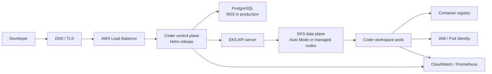
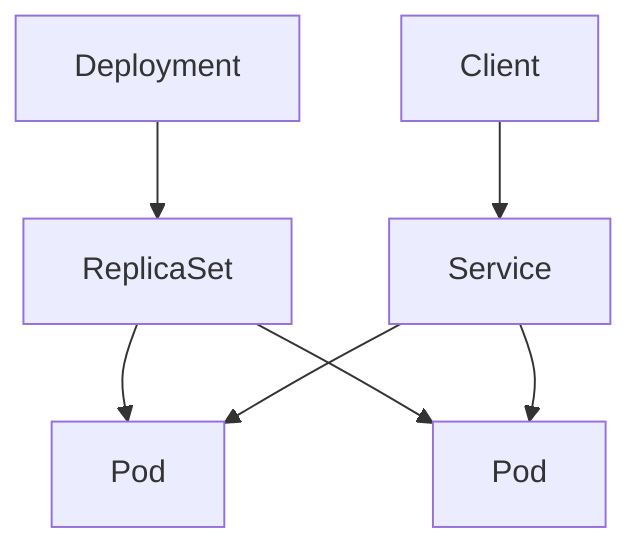
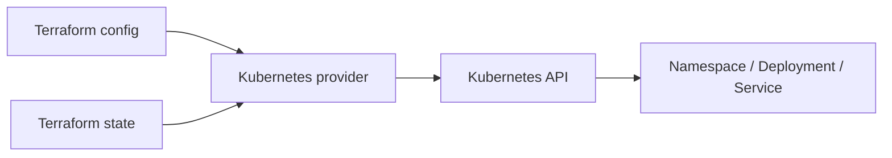
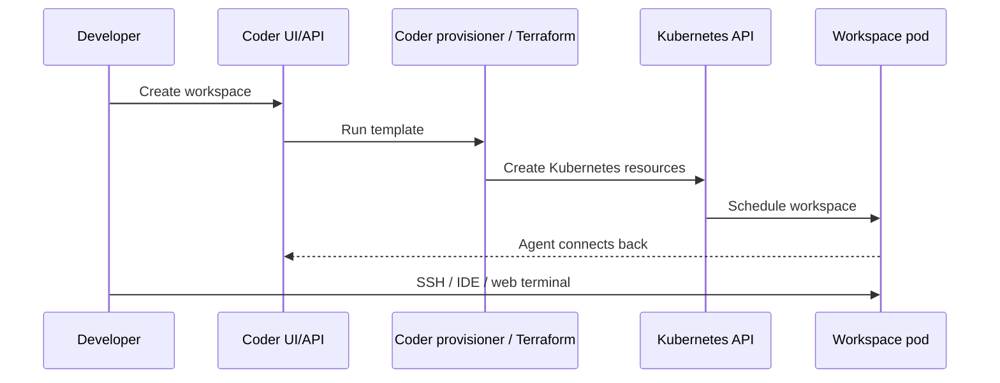
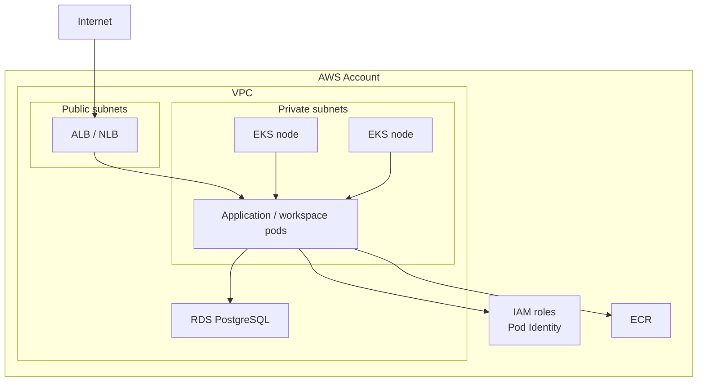
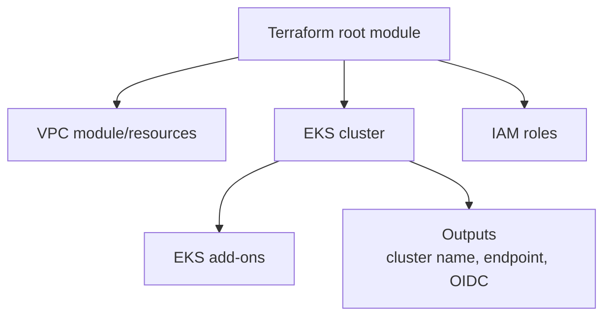
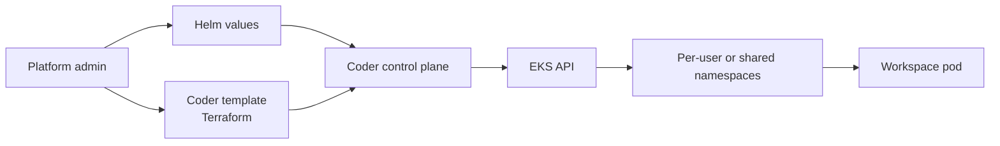

# EKS + Coder Learning Plan

This plan is optimized for moving quickly while still building a real architectural model in your head. Use the local Docker Desktop cluster first, then graduate the same ideas into EKS.

## Target Outcome

You should be able to explain and build this system:



The key idea: Coder is an application running on Kubernetes, but it also creates developer workspaces through Terraform templates. EKS supplies the managed Kubernetes control plane, AWS networking, identity, load balancing, storage, and node lifecycle. Terraform becomes the connective tissue: use it to model Kubernetes objects, AWS infrastructure, Coder templates, and eventually the full platform.

## Learning Path

### Phase 1: Local Kubernetes Foundations

Goal: become fluent with Kubernetes objects without paying for AWS while you learn.

Concepts:

- Cluster, node, namespace, pod, deployment, replica set, service, ingress.
- Desired state and reconciliation.
- Labels and selectors.
- ConfigMaps, Secrets, resource requests, and limits.
- `kubectl` debugging flow: `get`, `describe`, `logs`, `exec`, `events`.
- Terraform basics: providers, resources, variables, outputs, state, plan, apply, destroy.

Code:

- Run `part-01-local-kubernetes/manifests/hello-k8s.yaml`.
- Rebuild the same app with Terraform in `part-01-local-kubernetes/terraform/local-kubernetes`.
- Break it on purpose by changing an image tag or selector.
- Fix it using `kubectl describe` and `kubectl get events`.
- Compare `kubectl apply` with `terraform plan` so you can feel the difference between Kubernetes desired state and Terraform state.

Visual:





Exit criteria:

- You can expose a workload locally and explain why the Service can find the Pods.
- You can diagnose a pod that is pending, crashing, or unreachable.
- You can run `terraform plan`, predict what it will change, and explain where Terraform state fits.

### Phase 2: Coder On Local Kubernetes

Goal: understand Coder as a Kubernetes workload before adding AWS-specific concerns.

Concepts:

- Coder control plane vs Coder workspaces.
- Helm releases and values.
- PostgreSQL dependency.
- Coder templates as Terraform.
- Workspace pod lifecycle.
- Coder Terraform provider, `coder_agent`, workspace owner data, and Kubernetes resources created by templates.

Code:

- Use `part-02-coder-platform/helm-values/values-local.yaml` as a starting point.
- Install Coder with Helm into a `coder` namespace.
- Create a simple Kubernetes template in Coder that launches one workspace pod.
- Study and push `part-02-coder-platform/terraform/coder-template-kubernetes` once your local Coder install is ready.

Visual:



Exit criteria:

- You can explain what Coder stores in Postgres and what Kubernetes stores in etcd.
- You can tell whether a failure belongs to Helm, Coder, Terraform, or Kubernetes scheduling.
- You can explain why a Coder template is not just app code: it is Terraform that creates real infrastructure per workspace.

### Phase 3: EKS Architecture

Goal: map local Kubernetes concepts to AWS-managed components.

Concepts:

- EKS control plane vs data plane.
- VPC, subnets, route tables, NAT, security groups.
- AWS Load Balancer Controller or EKS Auto Mode load balancing.
- EBS CSI, storage classes, and persistent volumes.
- IAM, IRSA, and EKS Pod Identity.
- Cluster add-ons: CoreDNS, kube-proxy, VPC CNI, metrics, logging.
- Terraform AWS provider, remote state, modules, data sources, outputs, and environment separation.

Code:

- Study `part-02-coder-platform/eks/eksctl-auto-mode.yaml`.
- Study `part-02-coder-platform/terraform/eks-starter`.
- Create a throwaway EKS learning cluster only when you are ready to pay for AWS resources.
- Deploy the same hello app from Phase 1.
- Compare the local Service behavior with an AWS `LoadBalancer` Service.
- Compare the `eksctl` Auto Mode path with the Terraform managed-node-group path.

Visual:





Exit criteria:

- You can draw the request path from a browser to a Coder pod on EKS.
- You can explain what AWS manages and what you still own.
- You can read a Terraform EKS plan and identify which resources affect cost, networking, identity, and cluster access.

### Phase 4: Production-Shaped Coder On EKS

Goal: build toward the architecture you would defend in a real project.

Concepts:

- Coder Helm chart configuration.
- RDS PostgreSQL instead of in-cluster Postgres.
- Public vs private cluster endpoints.
- Ingress vs Service `LoadBalancer`.
- TLS and `CODER_ACCESS_URL`.
- Workspace pod resource limits, node isolation, and cost controls.
- Observability and audit requirements.
- Terraform composition: AWS infrastructure, Helm release, Kubernetes secrets, and Coder workspace templates.

Code:

- Start from `part-02-coder-platform/helm-values/values-eks.yaml`.
- Replace placeholders with your domain, secret names, and database URL secret.
- Deploy Coder.
- Create one Kubernetes workspace template.
- Add resource requests, limits, labels, and namespace isolation.
- Sketch a Terraform root module that owns EKS, RDS, Coder Helm deployment, and the database URL secret.

Visual:



Exit criteria:

- You can install Coder on EKS from Helm values and explain every required setting.
- You can reason about network reachability for dashboard, workspace agents, web apps, SSH, and port forwarding.
- You can separate Terraform responsibilities: platform infrastructure, Coder install, and workspace templates.

## Weekly Schedule

### Week 1: Kubernetes Muscle Memory

Daily work:

- 30 minutes reading one Kubernetes concept.
- 60 minutes applying it in the local cluster.
- 30 minutes translating one YAML object into Terraform.
- 15 minutes writing notes in this repo.

Deliverables:

- A working hello app.
- A Terraform-managed version of the hello app.
- A troubleshooting notebook with at least five failures and fixes.
- A diagram of Deployment, Service, Pod, and Namespace relationships.

### Week 2: Coder Locally

Daily work:

- Install Coder on local Kubernetes.
- Learn Helm values by changing one setting at a time.
- Create a minimal Coder Kubernetes workspace template.
- Modify the Coder template Terraform and push new template versions.

Deliverables:

- Local Coder deployment notes.
- First workspace template.
- A list of template changes and what Terraform planned for each one.
- A sequence diagram of workspace creation.

### Week 3: EKS Core Architecture

Daily work:

- Read one EKS topic: networking, identity, storage, autoscaling, observability.
- Map it to a Kubernetes primitive you already used locally.
- Apply the hello app to EKS.
- Model the EKS architecture in Terraform, even if you do not apply it yet.

Deliverables:

- EKS architecture diagram.
- Notes explaining VPC, subnets, node placement, IAM, and load balancers.
- Terraform plan notes for the EKS starter.
- Cost cleanup checklist.

### Week 4: Coder On EKS

Daily work:

- Deploy Coder with production-shaped values.
- Replace local assumptions with AWS-managed services.
- Add one hardening improvement per day.
- Decide what Terraform should own and what should stay manual while learning.

Deliverables:

- Coder-on-EKS runbook.
- Workspace template with resource controls.
- Terraform ownership map for EKS, RDS, Helm, secrets, and templates.
- Final architecture diagram and explanation.

## Practice Commands

Use this loop constantly:

```bash
kubectl get all -n <namespace>
kubectl describe pod <pod> -n <namespace>
kubectl logs <pod> -n <namespace>
kubectl get events -n <namespace> --sort-by=.metadata.creationTimestamp
kubectl explain deployment.spec.template.spec.containers
```

For Helm:

```bash
helm repo add coder-v2 https://helm.coder.com/v2
helm repo update
helm upgrade --install coder coder-v2/coder --namespace coder --create-namespace -f part-02-coder-platform/helm-values/values-local.yaml
helm status coder -n coder
helm get values coder -n coder
```

For Terraform:

```bash
cd part-01-local-kubernetes/terraform/local-kubernetes
terraform init
terraform fmt
terraform validate
terraform plan
terraform apply
terraform output port_forward_command
terraform destroy
```

For EKS:

```bash
eksctl create cluster -f part-02-coder-platform/eks/eksctl-auto-mode.yaml
aws eks update-kubeconfig --region us-east-1 --name coder-learning
kubectl get nodes
```

For Terraform EKS practice:

```bash
cd part-02-coder-platform/terraform/eks-starter
terraform init
terraform fmt
terraform validate
terraform plan
terraform apply
terraform output -raw update_kubeconfig_command
terraform destroy
```

## What To Read

- [Amazon EKS Best Practices Guide](https://docs.aws.amazon.com/eks/latest/best-practices/introduction.html)
- [EKS Auto Mode documentation](https://docs.aws.amazon.com/eks/latest/userguide/automode.html)
- [EKS Auto Mode best practices](https://docs.aws.amazon.com/eks/latest/best-practices/automode.html)
- [Install Coder on Kubernetes with Helm](https://coder.com/docs/install/kubernetes)
- [Coder templates](https://coder.com/docs/admin/templates)
- [Coder workspace proxies](https://coder.com/docs/admin/networking/workspace-proxies)
- [Terraform Kubernetes provider](https://registry.terraform.io/providers/hashicorp/kubernetes/latest/docs)
- [Terraform AWS provider](https://registry.terraform.io/providers/hashicorp/aws/latest/docs)
- [Coder Terraform provider](https://registry.terraform.io/providers/coder/coder/latest/docs)

## Cost Safety

EKS and load balancers can cost real money. For learning clusters:

- Prefer local Docker Desktop until you need AWS behavior.
- Use a short-lived EKS cluster.
- Tag everything.
- Tear down the cluster after each study session unless you need it running.
- Avoid production-sized node groups, NAT-heavy designs, and persistent load balancers while experimenting.

Cleanup:

```bash
eksctl delete cluster -f part-02-coder-platform/eks/eksctl-auto-mode.yaml
```
