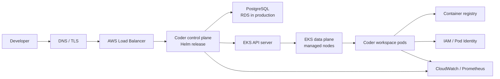
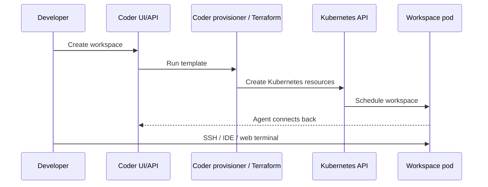
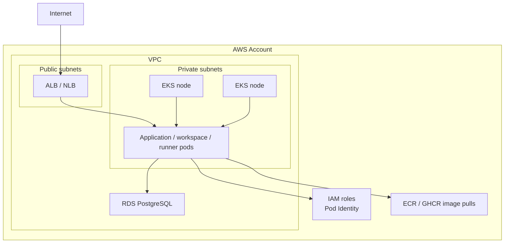

# Kubernetes Platform Learning Guide

This is the central learning guide for this repo. Use it as the "start here" file, then follow the linked walkthroughs and labs when a phase tells you to practice.

The repo already has good material. The main problem is not missing content; it is that the content is spread across several README and walkthrough files. This guide gives that material one sequence, one mental model, and one set of checkpoints.

## The Big Picture

You are learning one platform story in layers:

```text
Local Kubernetes
  -> Terraform against the Kubernetes API
  -> Helm and Coder on Kubernetes
  -> EKS as AWS-managed Kubernetes
  -> Coder on EKS
  -> ARC runners on Kubernetes
  -> ARC runners on EKS
```

The same Kubernetes object model shows up in every layer:

```text
Namespace -> Deployment -> ReplicaSet -> Pod -> Container
Service -> selects Pods with labels
Controller -> keeps actual state matched to desired state
```

The platform engineering skill is learning how that model changes when you add Terraform, Helm, AWS networking, AWS identity, storage, observability, cost controls, Coder workspaces, and GitHub Actions runners.

## Target Platform Diagrams

These diagrams are the destination. You do not need to understand every box at the start; use them to connect each lab back to the larger platform.

### Coder On EKS



### Workspace Creation Flow



### EKS Infrastructure Shape



## How To Use This Repo

This guide is the map. The part folders are the labs.

Use the repo in this order:

1. Start each phase in this guide so you know what you are trying to learn.
2. Open the linked `walkthrough.md` when you are ready to run commands.
3. Use the matching manifests, Helm values, or Terraform module as the working example.
4. Write short notes after each lab, especially when something breaks.
5. Move to the next phase only when you can explain the exit criteria in your own words.

Folder roles:

```text
README.md
  Short repo orientation and quick start.

guides/kubernetes-platform-learning-guide.md
  This file. The learning sequence, checkpoints, and deliverables.

part-01-local-kubernetes/
  Local Kubernetes concepts, YAML, kubectl practice, and Terraform against Kubernetes.

part-02-coder-platform/
  Coder, Helm, Coder templates as Terraform, and the first EKS infrastructure lab.

part-03-arc-runners/
  GitHub Actions Runner Controller, runner images, and EKS runner platform work.

docs/
  Setup notes and supporting reference docs.
```

The important split:

- `guides/` is durable learning material.
- `part-*/walkthrough.md` is hands-on lab material.
- `docs/` is supporting reference material.

## Learning Tracks

The repo has three learning tracks. They build on each other:

1. `part-01-local-kubernetes` builds zero-cost Kubernetes muscle memory on Docker Desktop.
2. `part-02-coder-platform` turns Kubernetes into a developer platform with Coder, Helm, Terraform templates, and EKS.
3. `part-03-arc-runners` turns the same platform model into ephemeral CI runners with GitHub Actions Runner Controller.

The most important files to use first are:

- [part-01-local-kubernetes/kubernetes-universe-map.md](../part-01-local-kubernetes/kubernetes-universe-map.md)
- [part-01-local-kubernetes/walkthrough.md](../part-01-local-kubernetes/walkthrough.md)
- [part-01-local-kubernetes/manifests/hello-k8s.yaml](../part-01-local-kubernetes/manifests/hello-k8s.yaml)
- [part-01-local-kubernetes/terraform/local-kubernetes](../part-01-local-kubernetes/terraform/local-kubernetes)
- [part-02-coder-platform/terraform/eks-starter](../part-02-coder-platform/terraform/eks-starter)
- [part-02-coder-platform/terraform/coder-template-kubernetes](../part-02-coder-platform/terraform/coder-template-kubernetes)
- [part-03-arc-runners/walkthrough.md](../part-03-arc-runners/walkthrough.md)

As you move through the tracks, keep asking the same question: which Kubernetes objects are involved, and what extra platform responsibility did this phase add?

## Learning Rhythm

For each phase, use the same loop:

1. Read the concept section.
2. Run the lab.
3. Break one thing on purpose.
4. Debug with `kubectl`.
5. Write a short note explaining what happened.
6. Clean up anything that costs money.

Default debugging loop:

```bash
# List every Pod in every namespace. This is the fastest way to see what is running, pending, or crashing.
kubectl get pods -A

# Show cluster events across namespaces, sorted by most recent timestamp. Events often explain scheduling, image pull, and volume errors.
kubectl get events -A --sort-by=.lastTimestamp

# Show detailed status, conditions, container state, scheduling info, and recent events for one Pod.
kubectl describe pod <pod> -n <namespace>

# Print logs from the main container in one Pod. Use this when the container starts but the app is failing.
kubectl logs <pod> -n <namespace>

# Open a shell inside a running Pod. Use this to inspect files, environment variables, DNS, or network access from inside the workload.
kubectl exec -it <pod> -n <namespace> -- sh

# List Services across namespaces. Use this when traffic cannot reach a Pod or you need to find a stable endpoint.
kubectl get svc -A

# List Ingress resources across namespaces. Use this when HTTP routing from outside the cluster is involved.
kubectl get ingress -A

# List PersistentVolumeClaims across namespaces. Use this when storage or workspace home directories are involved.
kubectl get pvc -A
```

Default Terraform loop:

```bash
# Rewrite Terraform files into standard formatting so diffs stay readable.
terraform fmt

# Check whether Terraform syntax and provider configuration are valid.
terraform validate

# Preview what Terraform would create, change, or destroy before touching real resources.
terraform plan

# Make the changes shown in the plan.
terraform apply

# Remove the resources managed by this Terraform module when the lab is finished.
terraform destroy
```

The important Terraform habit is to predict the plan before applying it. That connects the syntax to real infrastructure changes.

## Command Reference

Use these loops constantly. They are not one-time commands; they are the muscle memory.

### Kubernetes

```bash
# Show common resources in one namespace: Pods, Services, Deployments, ReplicaSets, and more.
kubectl get all -n <namespace>

# Inspect one Pod in detail, including why it is pending, restarting, or failing.
kubectl describe pod <pod> -n <namespace>

# Read the application logs from one Pod.
kubectl logs <pod> -n <namespace>

# Show recent events in one namespace. This is useful when a Pod never starts or a Service cannot find endpoints.
kubectl get events -n <namespace> --sort-by=.metadata.creationTimestamp

# Ask Kubernetes to explain a specific manifest field. This is like built-in API documentation.
kubectl explain deployment.spec.template.spec.containers
```

### Helm

```bash
# Add Coder's Helm chart repository to your local Helm config.
helm repo add coder-v2 https://helm.coder.com/v2

# Download the latest chart index from configured Helm repositories.
helm repo update

# Install or upgrade the Coder Helm release using the local values file.
helm upgrade --install coder coder-v2/coder --namespace coder --create-namespace -f part-02-coder-platform/helm-values/values-local.yaml

# Show whether the Coder Helm release installed successfully.
helm status coder -n coder

# Print the values currently applied to the Coder Helm release.
helm get values coder -n coder
```

### Local Kubernetes Terraform

```bash
# Move into the Terraform module that recreates the local hello app.
cd part-01-local-kubernetes/terraform/local-kubernetes

# Download the providers listed in versions.tf.
terraform init

# Format the Terraform files.
terraform fmt

# Check syntax and provider configuration.
terraform validate

# Preview the Kubernetes objects Terraform will create or change.
terraform plan

# Apply the plan and create the local Kubernetes resources.
terraform apply

# Print the kubectl command that connects your browser to the Service.
terraform output port_forward_command

# Delete the Terraform-managed Kubernetes resources.
terraform destroy
```

### EKS With eksctl

```bash
# Create an EKS cluster from the eksctl YAML file. This creates paid AWS resources.
eksctl create cluster -f part-02-coder-platform/eks/eksctl-auto-mode.yaml

# Update kubeconfig so kubectl can talk to the new EKS cluster.
aws eks update-kubeconfig --region us-east-1 --name coder-learning

# Confirm that EKS worker nodes joined the Kubernetes cluster.
kubectl get nodes
```

### EKS With Terraform

```bash
# Move into the Terraform EKS starter module.
cd part-02-coder-platform/terraform/eks-starter

# Download AWS provider and module dependencies.
terraform init

# Format Terraform files.
terraform fmt

# Validate Terraform syntax and provider configuration.
terraform validate

# Preview AWS resources such as VPC, subnets, EKS cluster, IAM roles, and node groups.
terraform plan

# Create the planned AWS resources. This creates paid AWS infrastructure.
terraform apply

# Print the AWS CLI command that configures kubectl for the new cluster.
terraform output -raw update_kubeconfig_command

# Destroy the EKS lab resources when you are finished.
terraform destroy
```

## Phase 0: Tooling And Local Cluster

Goal: make sure your Mac, devcontainer, Docker Desktop Kubernetes, and CLI tools agree with each other.

Primary files:

- [docs/devcontainer-setup.md](../docs/devcontainer-setup.md)
- [.devcontainer/setup.sh](../.devcontainer/setup.sh)

Do:

1. Rebuild the devcontainer.
2. Verify the Docker Desktop Kubernetes context.
3. Confirm the API endpoint is `https://kubernetes.docker.internal:6443` inside the devcontainer.
4. Confirm tools are installed: `kubectl`, `helm`, `terraform`, `terraform-ls`, `tflint`, `yq`, `aws`, `gh`, `eksctl`, `kind`, and `coder`.
5. Confirm architecture with `uname -m` and `kubectl get nodes -o wide`.

What you should learn:

- Docker Desktop owns the local Kubernetes cluster.
- The devcontainer owns your tools.
- `kubectl` talks to the cluster through kubeconfig.
- On Apple Silicon, local and container workloads may be `arm64`, while some EKS examples may use `amd64`.

Exit criteria:

- `kubectl config current-context` points at `docker-desktop`.
- `kubectl get nodes` works from inside the devcontainer.
- You can explain why `127.0.0.1:6443` is wrong inside the devcontainer.

## Apple Silicon, ARM, And Container Images

This repo assumes you are working from an Apple Silicon Mac, such as a MacBook Air M2. That means there are a few architecture layers to keep straight:

- The Mac host is ARM.
- The devcontainer usually runs Linux ARM.
- Docker Desktop Kubernetes runs a local node that can run ARM-compatible workloads.
- EKS node groups can be x86 (`amd64`) or ARM (`arm64`) depending on the EC2 instance types you choose.

The practical rule is simple: a container image must support the CPU architecture of the Kubernetes node that runs it.

For the local nginx walkthrough, there is nothing special to do. The official nginx image supports common architectures, including `linux/arm64`.

The architecture check commands are:

```bash
uname -m
kubectl get nodes -o wide
```

Use them to answer:

- What architecture are my local tools running on?
- What architecture are my Kubernetes nodes using?

`docker buildx` becomes important later when you build your own images. It can build and publish multi-architecture images so the same image tag can work on both `linux/amd64` and `linux/arm64`.

Why this matters for EKS:

- If you use common x86 EC2 instances, your workloads need `linux/amd64` images.
- If you use AWS Graviton EC2 instances, your workloads need `linux/arm64` images.
- Graviton can be cost-effective, but every workload scheduled onto those nodes must support ARM.
- A mixed-architecture cluster is possible, but then scheduling rules and image support matter more.

So what? Architecture is not the main lesson in the first Kubernetes lab. It becomes important when you build custom workspace images, runner images, or EKS node groups.

## Phase 1: Kubernetes Object Model

Goal: understand the core objects before adding Coder, ARC, or AWS.

Primary files:

- [part-01-local-kubernetes/kubernetes-universe-map.md](../part-01-local-kubernetes/kubernetes-universe-map.md)
- [part-01-local-kubernetes/walkthrough.md](../part-01-local-kubernetes/walkthrough.md)

Do:

1. Read the universe map.
2. Create a namespace.
3. Create an nginx Deployment.
4. Scale it.
5. Expose it with a Service.
6. Use port-forwarding.
7. Delete a Pod and watch Kubernetes recreate it.
8. Roll out and roll back an image change.

What you should learn:

- A Pod is the smallest thing Kubernetes schedules.
- A Deployment manages ReplicaSets, and ReplicaSets keep the requested Pods running.
- A Service does not contain Pods. It finds them with labels and selectors.
- `kubectl describe` and events usually tell you why something is failing.

Exit criteria:

- You can draw `Deployment -> ReplicaSet -> Pod -> Container`.
- You can explain how a Service finds Pods.
- You can debug a basic `ImagePullBackOff`, crash loop, or broken selector.

## Phase 2: YAML App And Terraform Equivalent

Goal: connect raw Kubernetes YAML to Terraform-managed Kubernetes resources.

Primary files:

- [part-01-local-kubernetes/manifests/hello-k8s.yaml](../part-01-local-kubernetes/manifests/hello-k8s.yaml)
- [part-01-local-kubernetes/terraform/local-kubernetes](../part-01-local-kubernetes/terraform/local-kubernetes)

Do:

1. Apply the YAML app.
2. Inspect the Namespace, Deployment, Pods, and Service.
3. Port-forward to the Service.
4. Recreate the same app with Terraform.
5. Change `replicas` from `2` to `3` and inspect the plan.
6. Break the Service selector and fix it with `kubectl describe svc`.

What you should learn:

- Kubernetes stores desired state in the cluster.
- Terraform stores its own view of managed resources in state.
- `kubectl apply` changes Kubernetes directly.
- `terraform apply` changes Kubernetes through the Terraform Kubernetes provider.

Exit criteria:

- You can explain what is in `hello-k8s.yaml`.
- You can explain the Terraform resources that recreate it.
- You can describe the difference between Kubernetes desired state and Terraform state.

## Phase 3: Helm And Coder Locally

Goal: understand Coder as an application running on Kubernetes before paying for AWS.

Primary files:

- [part-02-coder-platform/README.md](../part-02-coder-platform/README.md)
- [part-02-coder-platform/walkthrough.md](../part-02-coder-platform/walkthrough.md)
- [part-02-coder-platform/helm-values/values-local.yaml](../part-02-coder-platform/helm-values/values-local.yaml)

Do:

1. Read the Coder mental model.
2. Install Coder locally with Helm.
3. Create or reference the `coder-db-url` secret needed by the Helm values.
4. Verify Coder Pods, Services, events, and logs.
5. Port-forward to the Coder service.
6. Create a simple workspace template.

What you should learn:

- Helm packages Kubernetes objects into an installable release.
- Helm values are the configuration surface for that release.
- The Coder control plane is separate from workspace compute.
- Coder stores platform data in Postgres.
- Workspace templates are Terraform that Coder runs for each workspace lifecycle.

Exit criteria:

- You can tell whether a Coder issue belongs to Helm, Kubernetes, Postgres, or a template.
- You can explain `CODER_ACCESS_URL`.
- You can explain why a Coder workspace template is infrastructure code, not just app code.

## Phase 4: Coder Template Terraform

Goal: learn how Coder uses Terraform to create per-workspace infrastructure.

Primary files:

- [part-02-coder-platform/terraform/coder-template-kubernetes](../part-02-coder-platform/terraform/coder-template-kubernetes)
- [part-02-coder-platform/coder-templates/README.md](../part-02-coder-platform/coder-templates/README.md)

Do:

1. Push the Kubernetes practice template to Coder.
2. Create a workspace from it.
3. Watch the Terraform logs in Coder.
4. Inspect the generated Kubernetes Namespace and Deployment.
5. Add a parameter for CPU or memory.
6. Add labels for owner, workspace, environment, and cost.
7. Add a PVC as a follow-up exercise.

What you should learn:

- `coder_agent` is what lets Coder connect into the workspace.
- The Kubernetes provider creates real cluster resources for each workspace.
- `start_count` controls whether workspace compute should exist.
- Labels are not decoration; they are how you inspect, group, route, and cost-track resources.

Exit criteria:

- You can explain the difference between platform Terraform and template Terraform.
- You can find the Kubernetes resources created for one workspace.
- You can explain what would happen when a workspace starts, stops, or is deleted.

## Phase 5: EKS Fundamentals

Goal: map local Kubernetes concepts to AWS-managed Kubernetes.

Primary files:

- [part-02-coder-platform/terraform/eks-starter](../part-02-coder-platform/terraform/eks-starter)
- [part-02-coder-platform/eks/eksctl-auto-mode.yaml](../part-02-coder-platform/eks/eksctl-auto-mode.yaml)

Do not start here. Only create EKS resources after local Kubernetes and the Terraform app are comfortable.

Do:

1. Read the EKS starter README before applying anything.
2. Review the Terraform plan.
3. Identify the VPC, subnets, EKS cluster, managed node group, and add-ons.
4. Apply only when you are ready for AWS cost.
5. Run the EKS smoke test.
6. Deploy the same `hello-k8s.yaml` app to EKS.
7. Destroy the cluster after the lab.

AWS concepts in practical terms:

- A VPC is your private network boundary in AWS.
- Subnets are smaller network ranges inside Availability Zones.
- Public subnets can route directly to the internet through an internet gateway.
- Private subnets usually need a NAT Gateway for outbound internet access.
- Security groups are network firewall rules attached to AWS resources.
- EKS manages the Kubernetes control plane for you.
- Managed node groups create EC2 instances that join the cluster as Kubernetes Nodes.
- EKS add-ons install cluster components such as CoreDNS, kube-proxy, VPC CNI, and Pod Identity Agent.

Cost drivers:

- EKS control plane hourly charges.
- EC2 node hours.
- EBS volumes created by workloads.
- Public IPv4 addresses.
- Load balancers created by Kubernetes Services or Ingress.
- NAT Gateway hourly and data processing charges if enabled.

Exit criteria:

- You can draw the difference between the EKS control plane and worker nodes.
- You can explain what Terraform creates in the EKS starter.
- You can identify which planned resources cost money.
- You can run and delete a hello app on EKS.

## Phase 6: Production-Shaped Coder On EKS

Goal: turn local Coder knowledge into a realistic AWS architecture.

Primary files:

- [part-02-coder-platform/helm-values/values-eks.yaml](../part-02-coder-platform/helm-values/values-eks.yaml)
- [part-02-coder-platform/terraform/eks-starter](../part-02-coder-platform/terraform/eks-starter)

Do:

1. Start from the EKS starter cluster.
2. Confirm the hello app runs before installing Coder.
3. Review the EKS Helm values.
4. Decide how Postgres is provided for the lab.
5. Create the Kubernetes Secret for `CODER_PG_CONNECTION_URL`.
6. Install Coder with Helm.
7. Expose Coder with a Service or Ingress.
8. Create one Kubernetes workspace template.
9. Add resource requests, limits, labels, and cleanup notes.

What you should learn:

- Running Coder on EKS adds AWS networking, storage, identity, and cost questions around the same Coder control plane.
- A `LoadBalancer` Service can create a real AWS load balancer.
- RDS is the production-shaped Postgres answer, but it is an extra paid AWS service.
- EBS-backed PVCs can outlive Pods, so storage cleanup matters.

Exit criteria:

- You can explain the browser-to-Coder request path on EKS.
- You can explain where Coder stores data and where workspace Pods run.
- You can separate ownership between AWS Terraform, Helm values, Kubernetes Secrets, and Coder template Terraform.

## Phase 7: ARC Local Lab

Goal: understand GitHub Actions Runner Controller without adding EKS cost.

Primary files:

- [part-03-arc-runners/README.md](../part-03-arc-runners/README.md)
- [part-03-arc-runners/walkthrough.md](../part-03-arc-runners/walkthrough.md)
- [part-03-arc-runners/kubernetes/README.md](../part-03-arc-runners/kubernetes/README.md)

Do:

1. Inventory the current GitHub runner setup.
2. Create a test repo or pick a low-risk repo.
3. Install the GitHub-supported ARC controller with Helm.
4. Install one runner scale set.
5. Create a workflow with `runs-on` set to the scale set name.
6. Watch runner Pods appear, run the job, and disappear.

What you should learn:

- ARC is a Kubernetes controller for GitHub Actions runners.
- A runner scale set maps to the workflow `runs-on` label.
- The job runs inside an ephemeral Kubernetes Pod.
- Runner images are the replacement for snowflake, long-lived runner machines.

Exit criteria:

- You can explain how GitHub finds the runner.
- You can find the runner Pod for a queued job.
- You can debug a stuck job by checking GitHub, ARC controller logs, Pods, events, and Secrets.

## Phase 8: ARC Runner Images And EKS

Goal: move from local ARC mechanics to a production-shaped runner platform.

Primary files:

- [part-03-arc-runners/runner-images/README.md](../part-03-arc-runners/runner-images/README.md)
- [part-03-arc-runners/terraform/README.md](../part-03-arc-runners/terraform/README.md)
- [part-03-arc-runners/walkthrough.md](../part-03-arc-runners/walkthrough.md)

Do:

1. Build a custom runner image with the tools your workflows need.
2. Publish the image to GHCR or ECR.
3. Configure ARC to use that image.
4. Create a small EKS runner lab.
5. Install ARC on EKS.
6. Run a real sample workflow.
7. Measure startup time, job duration, failure behavior, and cleanup.
8. Destroy the EKS lab when finished.

What you should learn:

- CI runners are platform workloads.
- Node size, image pull time, caching, and autoscaling all affect developer experience.
- Secrets and cloud credentials need deliberate boundaries.
- `minRunners: 0` can reduce idle cost but may increase job startup latency.

Exit criteria:

- You can explain the ARC request path from GitHub job queue to Kubernetes Pod.
- You can explain the difference between repo-level, org-level, and team-level runner isolation.
- You can identify cost and security tradeoffs in the runner platform.

## Suggested 6-Week Schedule

The old 4-week framing is possible, but this repo now covers enough ground that a 6-week schedule is healthier.

### Week 1: Local Kubernetes

Deliverables:

- Working `nginx-demo` from the walkthrough.
- Working `hello-k8s.yaml` app.
- A note explaining Deployment, ReplicaSet, Pod, Service, labels, and namespace.
- At least three intentional failures and fixes.

### Week 2: Terraform And Helm

Deliverables:

- Terraform-managed local hello app.
- A written comparison of YAML apply vs Terraform apply.
- Local Coder Helm install notes.
- A note explaining Helm release, chart, and values.

### Week 3: Coder Templates

Deliverables:

- One Docker-backed or Kubernetes-backed Coder workspace template.
- A template change log showing what Terraform planned.
- A note explaining platform Terraform vs template Terraform.
- A label strategy for workspace resources.

### Week 4: EKS Fundamentals

Deliverables:

- EKS starter plan review.
- Short-lived EKS cluster, if you are ready for AWS cost.
- Hello app running on EKS.
- Cost cleanup checklist.
- A note explaining VPC, subnets, node groups, add-ons, and load balancers.

### Week 5: Coder On EKS

Deliverables:

- Coder Helm values review for EKS.
- One Coder deployment on EKS, or a dry-run architecture if avoiding cost.
- One workspace template tested against EKS.
- A request path diagram from browser to Coder to workspace Pod.

### Week 6: ARC

Deliverables:

- Current runner inventory.
- Local ARC runner scale set lab.
- One custom runner image plan.
- Optional EKS ARC lab.
- Migration notes for one low-risk workflow.

## Reference Reading

Use these after you have touched the local examples. They will make more sense once you have seen Pods, Services, Helm values, and Terraform plans in this repo.

- [Amazon EKS Best Practices Guide](https://docs.aws.amazon.com/eks/latest/best-practices/introduction.html)
- [EKS Auto Mode documentation](https://docs.aws.amazon.com/eks/latest/userguide/automode.html)
- [EKS Auto Mode best practices](https://docs.aws.amazon.com/eks/latest/best-practices/automode.html)
- [Install Coder on Kubernetes with Helm](https://coder.com/docs/install/kubernetes)
- [Coder templates](https://coder.com/docs/admin/templates)
- [Coder workspace proxies](https://coder.com/docs/admin/networking/workspace-proxies)
- [Terraform Kubernetes provider](https://registry.terraform.io/providers/hashicorp/kubernetes/latest/docs)
- [Terraform AWS provider](https://registry.terraform.io/providers/hashicorp/aws/latest/docs)
- [Coder Terraform provider](https://registry.terraform.io/providers/coder/coder/latest/docs)

## Notes To Keep

Create notes as you learn. Keep them short and practical:

```text
docs/notes/
  01-kubectl-debugging.md
  02-yaml-vs-terraform.md
  03-coder-template-lifecycle.md
  04-eks-networking-costs.md
  05-arc-runner-migration.md
```

Each note should answer:

- What did I build?
- What broke?
- How did I debug it?
- What does this teach me for Coder, EKS, or ARC?
- What costs money or creates security risk?

## Final Skill Checklist

By the end of this guide, you should be able to explain:

- How `kubectl` reaches a cluster through kubeconfig.
- What Kubernetes controllers do.
- How Deployments, ReplicaSets, Pods, Services, labels, ConfigMaps, Secrets, and PVCs relate.
- How Terraform can manage Kubernetes objects.
- How Helm installs an application into Kubernetes.
- How Coder separates control plane, Postgres data, workspace templates, agents, and workspace compute.
- How EKS maps Kubernetes control plane and worker node responsibilities onto AWS.
- What VPCs, subnets, NAT Gateways, route tables, security groups, IAM roles, EBS volumes, and load balancers do in the EKS path.
- Which AWS resources are the main cost drivers.
- How ARC creates ephemeral GitHub runner Pods.
- How runner labels, runner scale sets, custom images, and node capacity affect CI workflows.

## Future Lab Ideas

After the core path is comfortable, these are good ways to deepen the repo:

1. Split the Coder track into smaller focused labs:
   - `coder-local-docker.md`
   - `coder-local-kubernetes.md`
   - `coder-template-terraform.md`
   - `coder-on-eks.md`
2. Add an ARC local Helm values example under `part-03-arc-runners/kubernetes/`.
3. Add lab notes under `docs/notes/` for your own failure writeups and explanations.

The important thing is to keep this guide as the source of truth for sequence. The walkthroughs can evolve as labs, but this file should keep answering: what should I learn next, why does it matter, and how do I know I am ready to move on?
