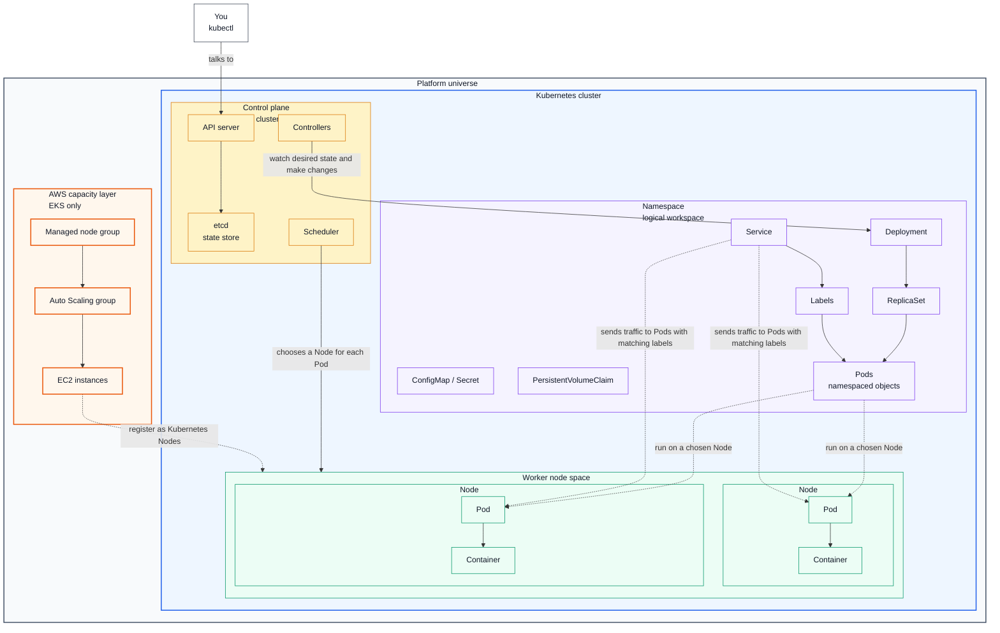

# Kubernetes Universe Map

Think of Kubernetes like a small universe with layers inside layers.



## How To Read The Diagram

- The **platform boundary** is where the cluster lives. Locally, that is Docker Desktop on your Mac. In AWS, that is your AWS account.
- The **Kubernetes cluster** contains the control plane, worker nodes, namespaces, and Kubernetes objects.
- The **control plane** is the brain of the cluster. `kubectl` talks to the API server, the API server stores state, the scheduler chooses nodes for Pods, and controllers keep reality matching the desired state.
- **Worker nodes** are the machines that run Pods. In Docker Desktop, this is usually one local node. In EKS, these are usually EC2 instances or Fargate capacity.
- A **node group** is an EKS/AWS concept, not a basic Kubernetes object. A managed node group creates and manages a group of EC2 worker instances. Those EC2 instances join the Kubernetes cluster and appear to Kubernetes as Nodes.
- A **namespace** is a logical workspace inside the cluster. Deployments, Services, ConfigMaps, Secrets, and PVCs live in namespaces.
- **Pods** are a little special: they belong to a namespace, but they are also scheduled onto a node. The diagram draws them under worker nodes to show where they run.
- A **Deployment** creates and manages a **ReplicaSet**. The ReplicaSet keeps the requested number of Pods running.
- A **Service** does not contain Pods. It finds Pods through labels and gives them a stable network endpoint.
- An **Ingress** or cloud **LoadBalancer** is how outside traffic usually reaches a Service. In EKS, that often means AWS creates an ALB or NLB around your cluster.

## Arrow Labels In Plain English

- **talks to** means your `kubectl` command sends requests to the Kubernetes API server.
- **watch desired state and make changes** means controllers continuously compare what you asked for with what is actually running. For example, if a Deployment says "run 3 Pods" and only 2 exist, a controller helps create another one.
- **chooses a Node for each Pod** means the scheduler decides which worker machine should run a Pod. It considers available CPU, memory, rules, and constraints.
- **register as Kubernetes Nodes** means that in EKS, AWS EC2 instances join the cluster and show up as Kubernetes Nodes.
- **run on a chosen Node** means a Pod is still a namespaced Kubernetes object, but its containers execute on one specific worker node.
- **sends traffic to Pods with matching labels** means a Service looks for Pods with the right labels, then gives traffic a stable way to reach those Pods even if individual Pods are replaced.

## Where Node Groups Fit

Node groups matter most when you move from Docker Desktop to EKS:

```text
EKS managed node group
└── Auto Scaling group
    ├── EC2 instance -> Kubernetes Node
    ├── EC2 instance -> Kubernetes Node
    └── EC2 instance -> Kubernetes Node
```

You use node groups to answer capacity questions:

- How many worker machines should the cluster have?
- What EC2 instance type should run the Pods?
- Should these nodes be x86 or ARM?
- Should this group run general workloads, Coder workspaces, CI runners, or system add-ons?
- How should the cluster scale up and down?

For this repo and your Apple Silicon context, that ARM question matters. Locally you are on `arm64`. In EKS, you could use Graviton EC2 instances such as `t4g`, `m7g`, or `c7g` for ARM-based node groups, but every container image scheduled there must support `linux/arm64`.

## Core Nesting Model

```text
Your computer / AWS account
└── Kubernetes cluster
    ├── Control plane
    │   ├── API server
    │   │   └── kubectl talks to this
    │   ├── scheduler
    │   │   └── chooses which node should run each Pod
    │   └── controllers
    │       └── keep the real cluster matched to the desired state
    │
    ├── Nodes
    │   └── worker machines that run workloads
    │       └── Pods
    │           └── Containers
    │               └── app processes, such as nginx
    │
    └── Namespaces
        └── logical workspaces inside the same cluster
            ├── Deployments
            │   └── ReplicaSets
            │       └── Pods
            │           └── Containers
            ├── Services
            │   └── stable network names and virtual IPs for Pods
            ├── ConfigMaps
            │   └── non-secret app configuration
            ├── Secrets
            │   └── sensitive app configuration
            ├── Ingresses
            │   └── HTTP routing from outside the cluster
            └── PersistentVolumeClaims
                └── storage requests for Pods
```

The biggest mental model is this:

```text
You declare desired state
        |
        v
Kubernetes control plane stores and watches that desired state
        |
        v
Controllers create or update lower-level resources
        |
        v
Nodes run Pods
        |
        v
Containers run your app
```

## Nginx Example

For the nginx demo in the walkthrough, the relationship looks like this:

```text
Namespace: lab
├── Deployment: nginx-demo
│   └── ReplicaSet: nginx-demo-...
│       ├── Pod: nginx-demo-...
│       │   └── Container: nginx
│       ├── Pod: nginx-demo-...
│       │   └── Container: nginx
│       └── Pod: nginx-demo-...
│           └── Container: nginx
│
└── Service: nginx-demo
    └── selects Pods using labels
        └── sends traffic to the nginx Pods
```

Important relationships:

- A **cluster** contains the Kubernetes control plane, nodes, namespaces, and workloads.
- A **node** is a machine that runs Pods. In Docker Desktop, this is your local Docker Desktop VM. In EKS, nodes are usually EC2 instances or Fargate capacity.
- A **namespace** is a logical workspace inside a cluster. The `lab` namespace keeps the walkthrough's resources separate from system resources.
- A **Pod** is the smallest unit Kubernetes schedules. A Pod wraps one or more containers.
- A **container** is where the actual app process runs.
- A **Deployment** manages a rollout-friendly desired state for Pods.
- A **ReplicaSet** is created by a Deployment to keep the requested number of matching Pods running.
- A **Service** gives changing Pods a stable network endpoint.
- **Labels** are key-value tags on resources. Services and Deployments use labels to find the Pods they should manage or route to.
- **kubectl** is the CLI client. It talks to the Kubernetes API server using your kubeconfig.

## Local To EKS

Local Docker Desktop Kubernetes and EKS use the same Kubernetes object model:

```text
Docker Desktop Kubernetes
└── Cluster on your Mac
    └── One local node
        └── Pods, Services, Deployments, Namespaces

Amazon EKS
└── AWS-managed Kubernetes control plane
    ├── EC2 or Fargate worker capacity
    ├── VPC networking
    ├── IAM permissions
    ├── Load balancers
    └── Pods, Services, Deployments, Namespaces
```

So what? Learning these relationships locally means the Kubernetes part transfers directly to EKS later. The new EKS layer is mostly AWS infrastructure around the cluster: networking, IAM permissions, load balancers, storage, logging, and cost management.
