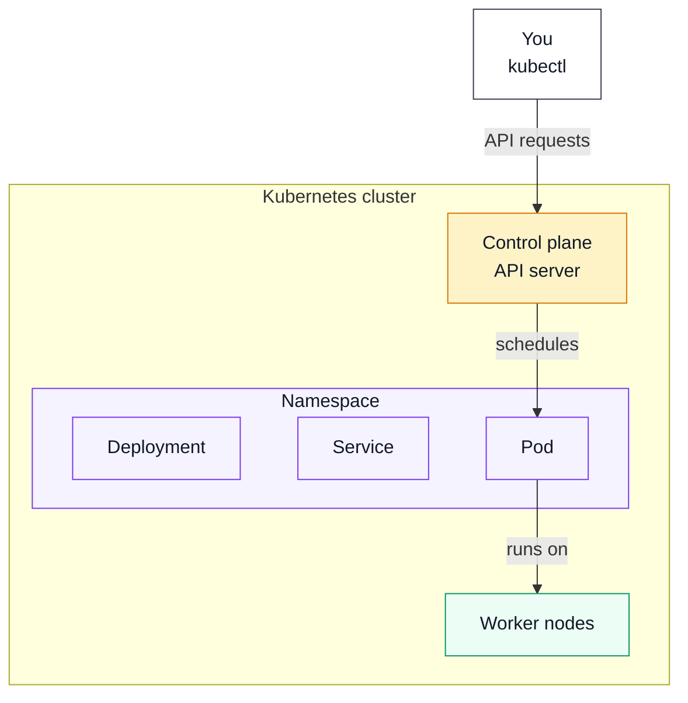
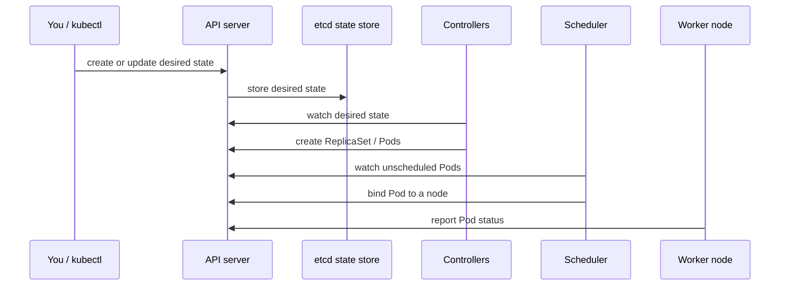
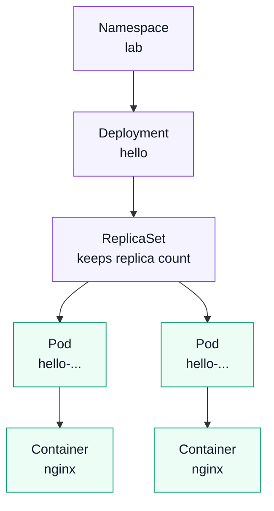
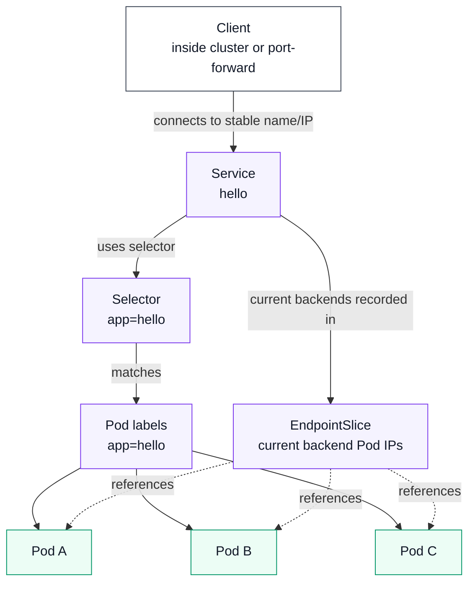
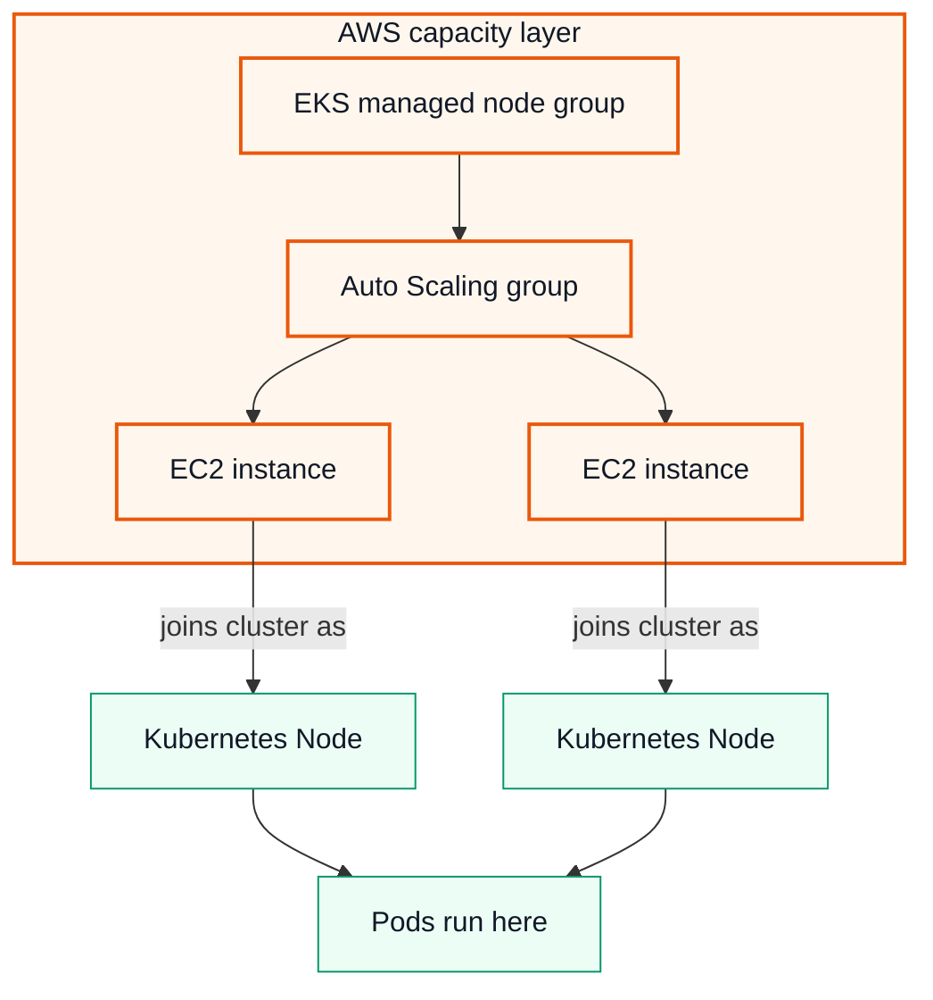

# Kubernetes Universe Map

Think of Kubernetes like a small universe with layers inside layers.

This page is split into small maps so each relationship is easier to read. Start with the platform boundary, then follow the control loop, workload chain, and networking path.

The examples use the `lab` namespace and the `hello` app from the walkthrough. The follow-up YAML lab uses a separate `hello` namespace with a `hello-web` app, and the Terraform app uses `tf-hello`, but the object relationships are the same.

## Platform Boundary

Locally, the platform is Docker Desktop on your Mac. In EKS, the platform is your AWS account.

```text
Platform
Docker Desktop locally, AWS account in EKS
└── Kubernetes cluster
    ├── Control plane
    │   └── API server, scheduler, controllers, state store
    ├── Worker nodes
    │   └── machines that run Pods
    └── Namespaces
        └── logical workspaces for namespaced objects
            ├── Deployments
            ├── Services
            └── Pods
```

The important cross-links:

```text
kubectl -> talks to -> control plane API server
control plane -> schedules -> Pods
Pods -> run on -> worker nodes
```

Same idea as a small diagram:



## Control Plane Loop

The control plane stores desired state and keeps working to make the real cluster match it.

For a Deployment, the loop is:

1. You run a `kubectl` command.  
   Example: `kubectl create deployment hello --image=nginx:1.27-alpine -n lab`
2. `kubectl` sends a matching API request to the API server.  
   Meaning: "create a Deployment named `hello` in the `lab` namespace."
3. The API server validates the request and stores the desired state in `etcd`.  
   You can read it back with: `kubectl get deployment hello -n lab`
4. Controllers notice the desired state and create lower-level objects.  
   For a Deployment, that means a ReplicaSet and then Pods.
   You can see them with: `kubectl get replicaset,pods -n lab`
5. The scheduler notices Pods that do not have a node yet.  
   You can inspect scheduling details with: `kubectl describe pod <pod-name> -n lab`
6. The scheduler assigns each Pod to a worker node.  
   You can see the chosen node with: `kubectl get pods -o wide -n lab`
7. The worker node starts the Pod's containers.  
   You can check the app process with: `kubectl logs <pod-name> -n lab`



Important precision: the scheduler does not schedule Deployments or Services. It schedules Pods. Deployments and Services are desired-state objects stored in the API. Controllers and the scheduler work from that stored state.

## Workload Chain

For normal application workloads, you usually create a Deployment. Kubernetes creates the lower-level objects.



## Service To Pods

A Service does not contain Pods. It finds matching Pods by labels and gives them a stable network endpoint. Kubernetes records the current backend Pod IPs in EndpointSlices.



## EKS Node Groups

This layer exists in EKS, not in basic Docker Desktop Kubernetes. You do not need it to finish Part 1; it is here so the local `Node` concept has a place to land when you move to AWS later.



## How To Read These Maps

- The **platform boundary** is where the cluster lives. Locally, that is Docker Desktop on your Mac. In AWS, that is your AWS account.
- The **Kubernetes cluster** contains the control plane, worker nodes, namespaces, and Kubernetes objects.
- The **control plane** is the brain of the cluster. `kubectl` talks to the API server, the API server stores state, the scheduler chooses nodes for Pods, and controllers keep reality matching the desired state.
- **Worker nodes** are the machines that run Pods. In Docker Desktop, this might be one local node or a small local multi-node cluster. In EKS, nodes are usually EC2 instances or Fargate capacity.
- A **node group** is an EKS/AWS concept, not a basic Kubernetes object. A managed node group creates and manages a group of EC2 worker instances. Those EC2 instances join the Kubernetes cluster and appear to Kubernetes as Nodes.
- A **namespace** is a logical workspace inside the cluster. Deployments, Services, ConfigMaps, Secrets, and PVCs live in namespaces.
- **Pods** are a little special: they belong to a namespace, but they are also scheduled onto a node. The workload map shows their ownership chain, and the control plane map shows that Pods run on worker nodes.
- A **Deployment** creates and manages a **ReplicaSet**. The ReplicaSet keeps the requested number of Pods running.
- A **Service** does not contain Pods. It finds Pods through labels and gives them a stable network endpoint.
- An **EndpointSlice** records the current network endpoints behind a Service. In this lab, those endpoints are Pod IPs.
- An **Ingress** or cloud **LoadBalancer** is how outside traffic usually reaches a Service. In EKS, that often means AWS creates an ALB or NLB around your cluster.

## Arrow Labels In Plain English

- **sends API requests** means your `kubectl` command talks to the Kubernetes API server.
- **store state** means the API server records desired cluster state in `etcd`.
- **watch desired state** means controllers continuously compare what you asked for with what is actually running.
- **create lower-level objects** means a controller reacts to a higher-level object. For example, a Deployment leads to a ReplicaSet, and the ReplicaSet leads to Pods.
- **choose a node** means the scheduler decides which worker machine should run a Pod. It considers available CPU, memory, rules, and constraints.
- **runs on** means a Pod is still a Kubernetes object, but its containers execute on one specific worker node.
- **uses selector** and **matches** mean a Service finds Pods by comparing its selector to Pod labels.
- **current backends recorded in** means Kubernetes writes the current backend addresses into EndpointSlices so cluster networking can route Service traffic.
- **joins cluster as** means that in EKS, AWS EC2 instances register with Kubernetes and show up as Nodes.

## Where Node Groups Fit

Node groups matter most when you move from Docker Desktop to EKS:

```text
EKS managed node group
└── Auto Scaling group
    ├── EC2 instance -> Kubernetes Node
    ├── EC2 instance -> Kubernetes Node
    └── EC2 instance -> Kubernetes Node
```

You use node groups to answer capacity questions:

- How many worker machines should the cluster have?
- What EC2 instance type should run the Pods?
- Should these nodes be x86 or ARM?
- Should this group run general workloads, Coder workspaces, CI runners, or system add-ons?
- How should the cluster scale up and down?

For this repo and your Apple Silicon context, that ARM question matters. Locally you are on `arm64`. In EKS, you could use Graviton EC2 instances such as `t4g`, `m7g`, or `c7g` for ARM-based node groups, but every container image scheduled there must support `linux/arm64`.

## Core Nesting Model

```text
Your computer / AWS account
└── Kubernetes cluster
    ├── Control plane
    │   ├── API server
    │   │   └── kubectl talks to this
    │   ├── scheduler
    │   │   └── chooses which node should run each Pod
    │   └── controllers
    │       └── keep the real cluster matched to the desired state
    │
    ├── Nodes
    │   └── worker machines that run workloads
    │       └── Pods
    │           └── Containers
    │               └── app processes, such as nginx
    │
    └── Namespaces
        └── logical workspaces inside the same cluster
            ├── Deployments
            │   └── ReplicaSets
            │       └── Pods
            │           └── Containers
            ├── Services
            │   └── stable network names and virtual IPs for Pods
            ├── EndpointSlices
            │   └── current backend endpoints for Services
            ├── ConfigMaps
            │   └── non-secret app configuration
            ├── Secrets
            │   └── sensitive app configuration
            ├── Ingresses
            │   └── HTTP routing from outside the cluster
            └── PersistentVolumeClaims
                └── storage requests for Pods
```

The biggest mental model is this:

```text
You declare desired state
        |
        v
Kubernetes control plane stores and watches that desired state
        |
        v
Controllers create or update lower-level resources
        |
        v
Nodes run Pods
        |
        v
Containers run your app
```

## Nginx Example

For the nginx demo in the walkthrough, the relationship looks like this:

```text
Namespace: lab
├── Deployment: hello
│   └── ReplicaSet: hello-...
│       ├── Pod: hello-...
│       │   └── Container: nginx
│       ├── Pod: hello-...
│       │   └── Container: nginx
│       └── Pod: hello-...
│           └── Container: nginx
│
└── Service: hello
    ├── selects Pods using labels
    │   └── sends traffic to the nginx Pods
    └── EndpointSlice records current backend Pod IPs
```

Important relationships:

- A **cluster** contains the Kubernetes control plane, nodes, namespaces, and workloads.
- A **node** is a machine that runs Pods. In Docker Desktop, nodes run inside Docker Desktop's local Kubernetes environment. In EKS, nodes are usually EC2 instances or Fargate capacity.
- A **namespace** is a logical workspace inside a cluster. The `lab` namespace keeps the walkthrough's resources separate from system resources.
- A **Pod** is the smallest unit Kubernetes schedules. A Pod wraps one or more containers.
- A **container** is where the actual app process runs.
- A **Deployment** manages a rollout-friendly desired state for Pods.
- A **ReplicaSet** is created by a Deployment to keep the requested number of matching Pods running.
- A **Service** gives changing Pods a stable network endpoint.
- An **EndpointSlice** shows which Pod IPs are currently backing a Service.
- **Labels** are key-value tags on resources. Services and Deployments use labels to find the Pods they should manage or route to.
- **kubectl** is the CLI client. It talks to the Kubernetes API server using your kubeconfig.

## Local To EKS

Local Docker Desktop Kubernetes and EKS use the same Kubernetes object model:

```text
Docker Desktop Kubernetes
└── Cluster on your Mac
    └── One or more local nodes
        └── Pods, Services, EndpointSlices, Deployments, Namespaces

Amazon EKS
└── AWS-managed Kubernetes control plane
    ├── EC2 or Fargate worker capacity
    ├── VPC networking
    ├── IAM permissions
    ├── Load balancers
    └── Pods, Services, EndpointSlices, Deployments, Namespaces
```

So what? Learning these relationships locally means the Kubernetes part transfers directly to EKS later. The new EKS layer is mostly AWS infrastructure around the cluster: networking, IAM permissions, load balancers, storage, logging, and cost management.
